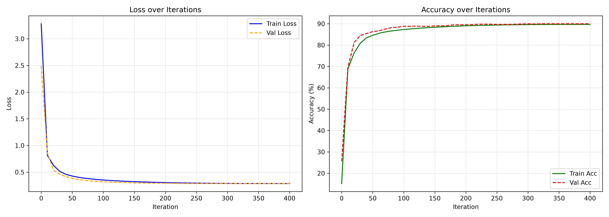
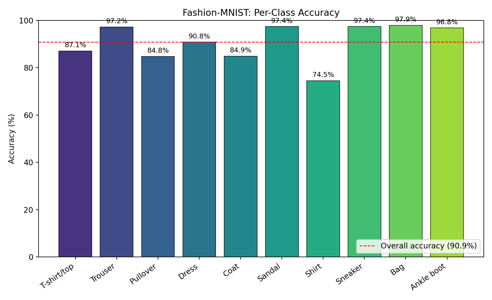
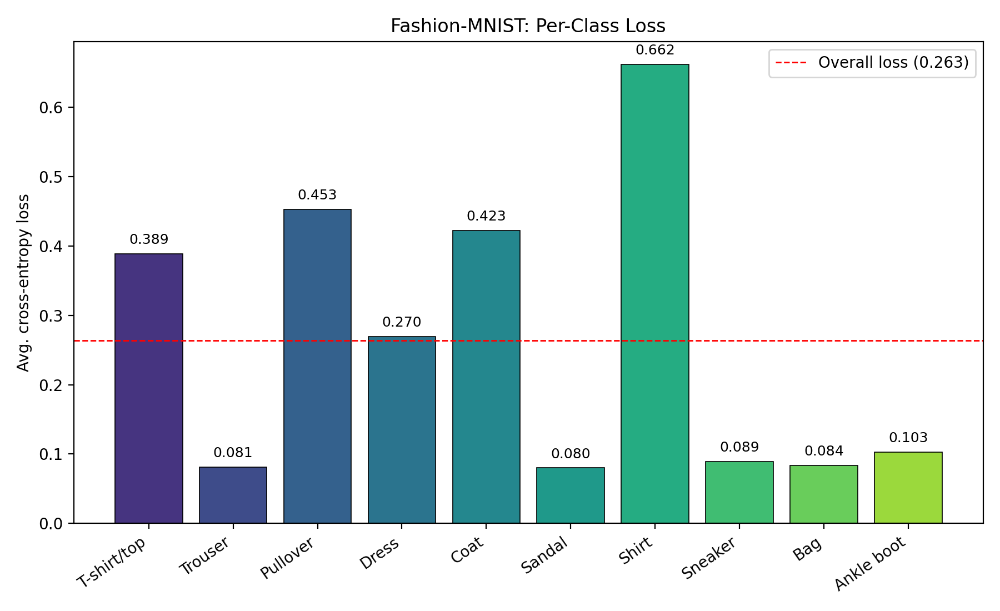
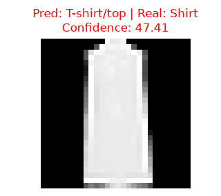
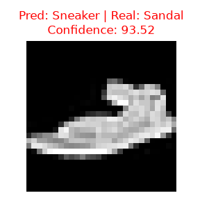

<a id="project"></a>

# project

A 3-layer neural network designed for multi-class classification, featuring custom training workflows and single-command inference.

### Key Highlights
* **Architecture:** 3-layer deep network (128 and 64 hidden units) with a 10-class output layer.
* **Optimization:** Implements He/Kaiming weight initialization, data standardization (mean/std scaling), and Cosine Annealing learning rate decay.
* **Zero-Setup Execution:** Datasets, sample test images, and pre-trained model weights (~90% accuracy) automatically download on the initial run.

| Table of Contents |
|---|
|- [Installation](#installation) |
|- [Usage](#usage) |
|- [Example](#example) |
|- [Model Metrics](#model-metrics) |
|- [Development Challenges](#development-challenges) |
|- [Learning Materials](#learning-materials) |


# installation

```bash
pip install -r requirements.txt
```


# usage

```bash
python project.py [-h] [-t [TRAIN]] [-i ITERATIONS] [-a ALPHA] [-b BETA]
                   [-p [IMAGE] [WEIGHTS]] [-tst [TEST]]
```


| Flag | Long form | Description | Default |
|---|---|---|---|
| `-t` | `--train` | Trains the network. Use `mini` for fast training, but it results in poor model accuracy, or `regular` for the full dataset (60,000 training examples) (~88–90% accuracy). | `regular` |
| `-i` | `--iterations` | Number of training iterations. | `500` |
| `-a` | `--alpha` | Learning rate (decays during training using cosine annealing) | `1.0` |
| `-b` | `--beta` | Beta (probably should keep it as it is) | `0.9` |
| `-p` | `--predict` | Uses trained weights to do a prediction on a provided image. Pass nothing for defaults, or pass IMAGE (png, jpg, jpeg, webp) or/and model weights (Optional) | `example.jpg` + `model_weights.npz` |
| `-tst` | `--test` | Opens a window with 20 example images from the fashion-mnist test dataset and runs a trained model on them. You can provide your own model.npz or leave empty to check the pretrained model. | `model_weights.npz` | 


# Example
```bash
# Train on the full dataset with default iterations and learning rate
python project.py -t regular
 
# Set your own iterations, learning rate and BETA
python project.py -t regular -i 1000 -a 0.5 -b 0.85
 
# Train on mini dataset (not recommended, mini dataset outputs very poor models)
python project.py -t mini -i 100
 
# Run the pretrained model on the default exmaple image
python project.py -p
 
# Run the pretrained model on your own image
python project.py -p my_photo.jpg

# Run a your own model on a specific image
python project.py -p my_photo.jpg my_model.npz
 
# Show 20 example samples from the test dataset on the pretrained model
python project.py -tst
 
# Show 20 examples samples from the dataste on your own trained model
python project.py -tst my_model.npz
```


# Model Metrics
The pretrained model has the following metrics
# **Train loss:** 0.263 | **Train accuracy:** 90.9% | **Test accuracy:** ~88%
 

# **Accuracy per class**
 

# **Loss per class**
 


# Development Challenges
This project has faced many obstacles during its development. From the sheer amount of functions, to their confusing implementations, but all of these hurdles have been overcome, and now I will mention some of the obstacles that I faced and beat.

1) **Training speed:** The first few runs of the training mechanisim took almost 45 minutes to complete. This was shocking because my machine is fairly strong. The solution to this problem was extremely simple, type cast every array to float32 and make sure they are a contigious array in memory. I had little knowledge about the different types of float and int, after discovering them and implementing them, my time per iteration dropped to around 0.22 seconds per iteration. Meaning I can train the same network in around 5 minutes.

2) **Accuracy and loss:** As like the training speed, the first few iterations of the training resulted in not so impressive accuracy and loss. The model stopped learning at 82-85% accuracy. While that range is not necessarly bad, I knew the network could output more. After research I came across He/Kaiming initializaion, which pairs perfectly with the ReLU activation function. Using He/kaiming instead of my previous random weights initialization. This initalizaion paired with Z-score normalization that I used for data standardization shot up the accuracy to a higher range of 87-88% accuracy.

3) **Manual Learning rate adjustment and Momentum(Beta):** During testing I had to manually adjust the decay scaling inside the code itself for every run. This was tedious work, and manual adjustment resulted in no improvement. Training accuracy was stuck at around 87-88% and validation accuracy was just short of it at 86-87%. I tried every combination of Learning rate, Learning rate decay rate, and iterations. In a total training time of more than 8 hours and more than 20 average models with medicore accuracy, I researched further to and learned about the Beta hyperparameter, what from it was that it controlled the momentum of the gradients, or in simple terms dictates how much the network relies on the old gradients. Implementing Beta in my network caused a decrease in loss, and less erratic behaviour in the graph of training. But the true masterpiece was the addition of Cosine Annealing for automatic learning rate adjustment. With just that simple function paired with Beta I pushed the network to its absolute limit reaching 90.8% accuracy, and 90.2% validation accuracy with a surprisingly low 0.263 loss on the first run after Cosine Annealing. The model I trained on that run is the one that has been provided along side this project.

4) **Dataset Resolution:** This is by the far the only problem that I wasnt able to solve, it limited the network greatly. This is no way the datasets fault or its creator, its a general problem with compressing images into 28x28 blobs of black and white. Most of the images in this dataset were very confusing, especially the coat, shirt, and pullover categories, as evident in the loss per class image. No matter what filters or tricks I tried to enhance the quality of the images, they were all to no avail. Even I as a human struggle to tell some of these images apart. here are a couple examples. This issue unfortunately causes the model to drop down to ~88% when ran against the test set.


Seeing where the model made mistakes and looking at the images myself I can forgive the model for getting ~88% on the test set.

 


# learning Materials
I would like to provide sources and credits to the amazing videos and explanations that truly helped me understand neural networks and their math. You could also follow the same path I took if you wish to learn more about this.


- [Linear Algebra / Neural Networks math and visualization: 3Blue1Brown (YouTube)](https://www.youtube.com/c/3blue1brown)
- [Transferring Neural Network knowledge to code: sentdex (YouTube)](https://www.youtube.com/c/sentdex)
- [Implementing functions from scratch in Python: SamsonZhangTheSalmon (YouTube)](https://www.youtube.com/@SamsonZhangTheSalmon)
- [Cosine Annealing explanation and formula](https://spotintelligence.com/2024/04/29/cosine-annealing-in-machine-learning/)
- [Momentum optimizer and Beta](https://www.geeksforgeeks.org/machine-learning/ml-momentum-based-gradient-optimizer-introduction/)


